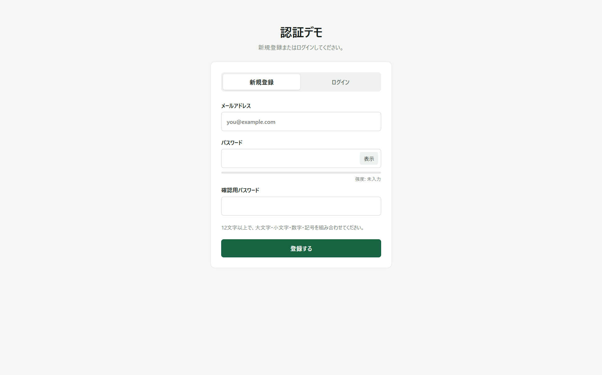
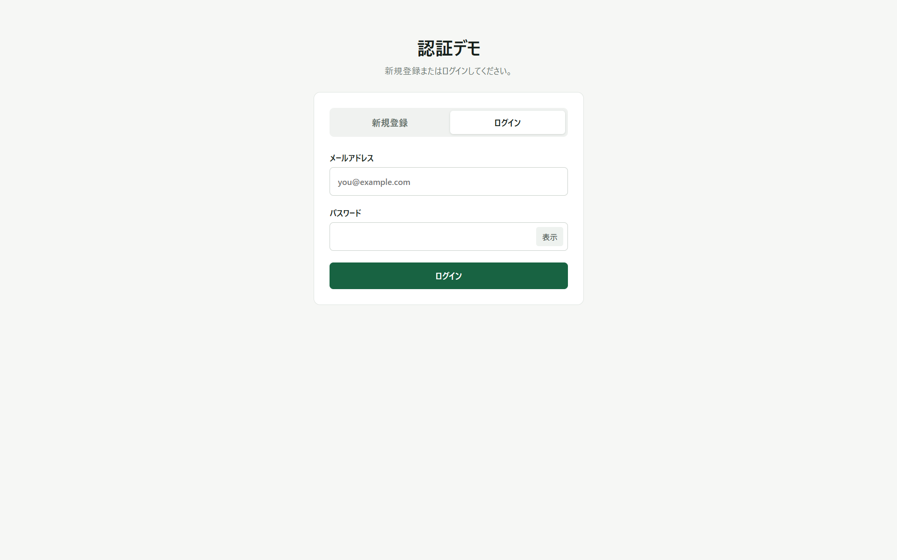
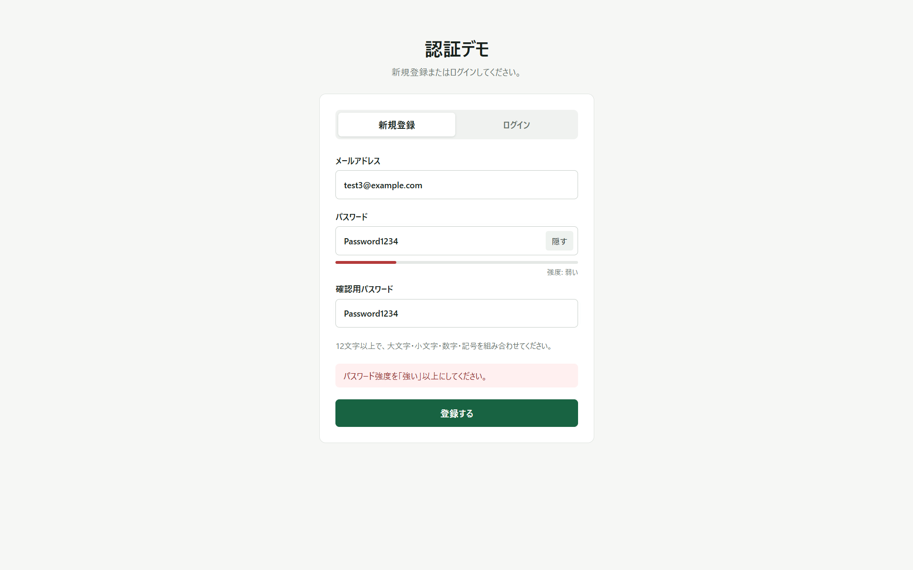
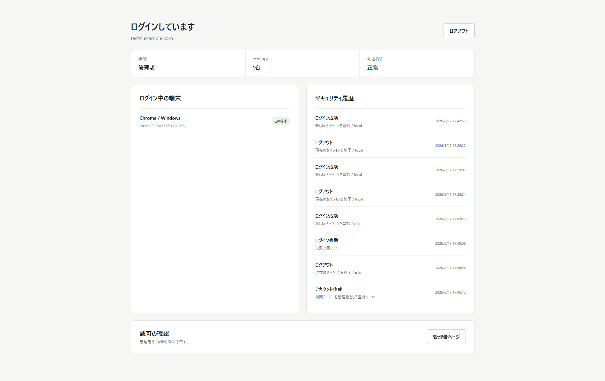
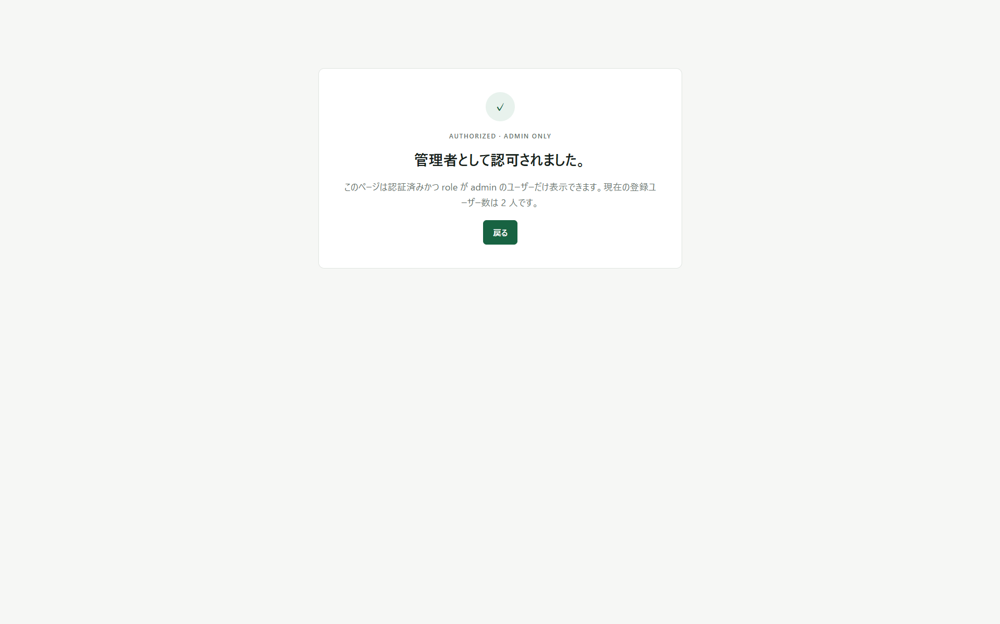

# AuthLab

Next.js App Routerで構築した、セキュリティ重視の認証・認可Webアプリケーションです。

認証基盤そのものをプロダクトとして設計し、セッション管理、ロールベースアクセス制御、攻撃耐性、監査可能性を一つのシンプルなUIにまとめました。画面上の操作だけでなく、Cookie、パスワード保存、CSRF、CSP、監査ログまでサーバー側で一貫して保護しています。

## 主な特徴

| 項目 | 実装内容 |
| --- | --- |
| 認証方式 | 推測困難なランダムトークンを用いたセッションベース認証 |
| 認可 | <code>admin</code>と<code>member</code>のロールを持たせ、<code>/admin</code>を管理者専用ページとして保護 |
| 多層防御 | 適応型ログイン制限、端末別セッション管理、改ざん検知付き監査ログ |
| 認証後の表示 | メールアドレス、権限、セッション、監査状態を表示 |
| パスワード保存 | bcrypt cost 12によるソルト付きハッシュ |
| Cookie | <code>HttpOnly</code>、<code>SameSite=Strict</code>、本番時<code>Secure</code>、<code>Priority=High</code> |
| CSP | リクエストごとのnonceと<code>strict-dynamic</code>を使用 |

## 技術スタック

- Next.js 16 App Router
- React 19
- TypeScript
- React Server Components
- Server Actions
- bcrypt
- Node.js Crypto API
- CSS
- Node.js Test Runner

外部の認証ライブラリへ処理を丸ごと委譲せず、認証フローの各段階を明示的に実装しています。これにより、セッションの生成・保存・失効、パスワード検証、アクセス制御、監査までの設計判断をソースコードから追える構成にしています。

## 画面

### 新規登録

メールアドレス、パスワード、確認用パスワードを入力します。パスワードは12文字以上128文字以下を要求します。

### ログイン

新規登録とログインは同じ画面内のタブで切り替えます。ログイン時に送信するのはメールアドレスとパスワードだけです。

### 弱いパスワードの拒否

入力中にパスワード強度をリアルタイム表示します。画面側とサーバー側は同じ判定関数を使用しており、表示と登録時の判定が食い違わないようにしています。

画像の「Password1234」は12文字以上ですが、よく使われる「password」を含み、記号もないため「弱い」と判定されます。登録操作を行っても、サーバー側で再検証して拒否します。

### ログイン後

ログイン後は、認証済みユーザーのメールアドレスとロール、現在有効なセッション数、監査ログの整合性を表示します。端末一覧とセキュリティ履歴もここから確認できます。

### 管理者専用ページ

<code>/admin</code>はログインしているだけでは表示できません。サーバー側でユーザーのロールが<code>admin</code>であることを検証し、条件を満たした場合だけ表示します。一般ユーザーは<code>/unauthorized</code>へ移動します。

## 認証方式

本アプリではセッションベース認証を採用しました。

1. 新規登録またはログインに成功すると、暗号学的乱数から256ビットのセッショントークンを生成します。
2. ブラウザにはトークンをCookieとして保存します。
3. サーバー側にはトークンそのものではなく、SHA-256ダイジェストだけを保存します。
4. 以後のリクエストではCookieの値をSHA-256化し、保存済みダイジェストと照合します。
5. セッションが存在し、有効期限内であり、対応するユーザーが存在する場合だけ認証成功とします。
6. セッションの有効期限は8時間です。ログアウト時はサーバー側セッションを削除し、Cookieも即時失効させます。

セッション保存データが漏えいしても、そのままCookieとして利用できないように、保存側にはダイジェストのみを保持しています。

## パスワードの保護

- <code>bcryptjs</code>によるbcryptを使用
- work factorは12
- bcryptが生成するランダムソルトにより、同一パスワードでも異なるハッシュを生成
- ログイン時は<code>bcrypt.compare</code>で検証
- 存在しないメールアドレスでもダミーのbcryptハッシュと比較し、処理時間の差によるアカウント列挙を軽減
- パスワードの最大長を128文字に制限し、極端に長い入力によるCPU負荷攻撃を軽減
- 旧版でscrypt保存された既存ユーザーは、正しいパスワードでログインしたときだけbcrypt cost 12へ自動移行
- パスワード、平文セッショントークン、Cookie値は監査ログへ記録しない

## 認可

ユーザーは<code>admin</code>または<code>member</code>のロールを持ちます。

- 最初に登録されたユーザーを<code>admin</code>に設定
- 2人目以降を<code>member</code>に設定
- <code>/admin</code>の表示前にサーバー側の<code>requireAdmin</code>を実行
- 未認証ユーザーは認証画面へ移動
- 認証済みでも<code>admin</code>でなければ<code>/unauthorized</code>へ移動

画面上でボタンを非表示にするだけではなく、ページのサーバー処理そのものをロール検証で保護しています。

## セキュリティ機能

### 1. 適応型ログイン試行制限

連続したログイン失敗に対して、固定時間ではなく失敗回数に応じた待機時間を設定します。

- メールアドレスと送信元IPの組み合わせをSHA-256化して制限キーを作成
- 3回目の失敗から待機時間を指数的に増加
- 待機時間は最大300秒
- 成功時は該当する失敗状態を解除
- 制限状態をサーバー側へ保存するため、画面の再読み込みでは解除されない
- エラーメッセージからアカウントの存在有無が判別されないよう、ログイン失敗時は共通メッセージを使用

総当たり攻撃やパスワードスプレー攻撃を遅延させることを目的としています。

### 2. 端末別セッション管理

1人のユーザーが複数端末からログインした場合、セッションを端末ごとに管理します。

- ブラウザとOSをUser-Agentから判別して表示
- IPアドレスは画面・監査ログ上でマスク
- セッションの作成日時を表示
- 現在操作中のセッションには「この端末」と表示
- 別端末のセッションを個別に失効可能
- 他人のセッションIDを送信しても、ログインユーザー自身のセッションでなければ削除しない
- 現在の端末は個別失効操作の対象外とし、通常のログアウトを使用

端末紛失や共有PCでのログアウト忘れに対応できます。

### 3. 改ざん検知付き監査ログ

アカウント作成、ログイン成功、ログイン失敗、ログアウト、セッション失効を記録します。

各イベントには直前のイベントのハッシュ値を含め、そのイベント全体をHMAC-SHA-256で署名します。これにより監査ログをハッシュチェーンとして連結しています。

- 途中のイベントを書き換えると、そのイベントの署名検証に失敗
- イベントを削除すると、次のイベントが保持する直前ハッシュと一致しない
- イベントの順番を変更してもチェーン検証に失敗
- ログイン後の画面で毎回チェーン全体を検証
- 正常なら「正常」、不整合があれば「不整合」と表示
- 本番環境では32文字以上の監査署名鍵を必須化

単なるログイン履歴ではなく、履歴が後から変更されていないか検証できる点が特徴です。

## その他の追加機能

### 確認用パスワード

新規登録時に同じパスワードを2回入力させ、サーバー側で一致を確認します。画面上の入力欄を改変または迂回しても、不一致の登録要求はサーバーで拒否します。

### パスワード強度表示

次の条件から0〜4段階で評価します。

- 12文字以上
- 16文字以上
- 大文字と小文字の両方を含む
- 数字を含む
- 記号を含む
- 「password」「qwerty」「123456」「admin」「letmein」を含む場合は減点

「強い」以上でなければ登録できません。判定関数はクライアントとサーバーで共有していますが、最終判断は必ずサーバー側で行います。

### パスワード表示切替

「表示」「隠す」ボタンでパスワードと確認用パスワードの表示状態を切り替えられます。

## CookieとCSRF対策

| Cookie属性 | 目的 |
| --- | --- |
| <code>HttpOnly</code> | JavaScriptからCookieを読み取れないようにし、XSS発生時のセッション窃取を軽減 |
| <code>SameSite=Strict</code> | 外部サイトを起点とするCookie送信を抑制 |
| <code>Secure</code> | 本番環境ではHTTPS通信時だけCookieを送信 |
| <code>Path=/</code> | アプリ全体で一貫してセッションを利用 |
| <code>Max-Age=28800</code> | 8時間で失効 |
| <code>Priority=High</code> | ブラウザによるCookie削除時の優先度を指定 |

ログイン、新規登録、ログアウト、セッション失効のServer Actionでは<code>Origin</code>と<code>Host</code>も比較します。本番環境ではHTTPSのOriginだけを許可し、異なるオリジンからの状態変更要求を拒否します。

## CSPとHTTPセキュリティヘッダー

<code>proxy.ts</code>でリクエストごとに新しいnonceを生成し、CSPをリクエストとレスポンスの両方へ設定します。全ページを動的レンダリングにすることで、各レスポンスのNext.jsスクリプトへ対応するnonceが付与されます。

本番用CSPの主な内容は次のとおりです。

- <code>default-src 'self'</code>
- <code>script-src 'self' 'nonce-...' 'strict-dynamic'</code>
- <code>style-src 'self' 'nonce-...'</code>
- <code>connect-src 'self'</code>
- <code>object-src 'none'</code>
- <code>base-uri 'none'</code>
- <code>form-action 'self'</code>
- <code>frame-ancestors 'none'</code>
- <code>media-src 'none'</code>
- <code>upgrade-insecure-requests</code>

本番用CSPでは<code>unsafe-inline</code>と<code>unsafe-eval</code>を許可していません。開発時のみ、Reactのデバッグ機能に必要な<code>unsafe-eval</code>を追加します。

その他、次のヘッダーを設定しています。

- <code>Strict-Transport-Security</code>
- <code>X-Content-Type-Options: nosniff</code>
- <code>X-Frame-Options: DENY</code>
- <code>Referrer-Policy: no-referrer</code>
- <code>Cross-Origin-Opener-Policy: same-origin</code>
- <code>Cross-Origin-Resource-Policy: same-origin</code>
- <code>Permissions-Policy</code>
- <code>X-DNS-Prefetch-Control: off</code>
- <code>X-Permitted-Cross-Domain-Policies: none</code>

## 入力検証と情報漏えい対策

- メールアドレスは形式と最大254文字を検証
- パスワードは12〜128文字
- パスワード強度と確認用パスワードをサーバー側で再検証
- パスワードハッシュをレスポンスへ含めない
- ログイン失敗時はメールアドレスとパスワードのどちらが違うかを区別しない
- User-Agentは保存前に180文字へ切り詰め
- IPアドレスは監査画面上でマスク
- セッション失効操作でユーザーIDの所有権を検証

## データ保存

現在の構成では、データを<code>.data/auth.json</code>へ保存します。

- <code>.data</code>は<code>.gitignore</code>対象
- 一時ファイルへ書き込んでからrenameし、書き込み途中の破損を軽減
- アプリ内の書き込みをキューで直列化
- 保存するパスワードはbcryptハッシュのみ
- 保存するセッショントークンはSHA-256ダイジェストのみ

実サービスへ展開する場合は、同じ認証ロジックをトランザクションと一意制約を備えたデータベースへ移植する想定です。

## 主なソースコード

| ファイル | 内容 |
| --- | --- |
| <code>app/page.tsx</code> | 未認証画面とログイン後画面、セッション・監査ログ表示 |
| <code>app/actions.ts</code> | 新規登録、ログイン、ログアウト、セッション失効、Origin検証 |
| <code>app/admin/page.tsx</code> | 管理者専用ページ |
| <code>app/unauthorized/page.tsx</code> | 権限不足画面 |
| <code>components/auth-form.tsx</code> | 認証UI、強度表示、表示切替 |
| <code>lib/auth.ts</code> | 認証、登録、レート制限、Cookie、セッション、認可 |
| <code>lib/security.ts</code> | bcrypt、旧scrypt検証、乱数トークン、SHA-256 |
| <code>lib/password-policy.ts</code> | 共有パスワード強度判定 |
| <code>lib/db.ts</code> | データ保存、排他制御、監査ログの署名と検証 |
| <code>proxy.ts</code> | nonce付きCSPとキャッシュ制御 |
| <code>next.config.mjs</code> | HTTPセキュリティヘッダー |
| <code>tests/security.test.ts</code> | bcrypt、強度判定、トークンダイジェストのテスト |

## 処理の流れ

~~~mermaid
flowchart LR
    A[ブラウザ] -->|新規登録・ログイン| B[Server Action]
    B --> C[Origin検証]
    C --> D[入力・強度検証]
    D --> E[bcrypt検証]
    E --> F[256ビットセッション生成]
    F --> G[HttpOnly Cookie]
    F --> H[SHA-256ダイジェストを保存]
    A -->|認証済みリクエスト| I[CookieをSHA-256化]
    I --> H
    H --> J[ユーザーとロール取得]
    J --> K[通常画面]
    J -->|adminのみ| L[管理者画面]
~~~

## 動作確認

- <code>npm test</code>: 3件成功
- <code>npm run build</code>: Next.js本番ビルド成功
- <code>npm audit --omit=dev</code>: 既知の脆弱性0件
- 本番CSPに<code>unsafe-inline</code>が含まれないことを確認
- 本番CSPに<code>unsafe-eval</code>が含まれないことを確認
- CSPのnonceがリクエストごとに変化することを確認
- ブラウザのCSPエラーが発生しないことを確認

## 起動方法

~~~bash
npm install
npm run dev
~~~

<code>http://localhost:3000</code>を開きます。最初に登録したユーザーが管理者、2人目以降が一般ユーザーになります。
